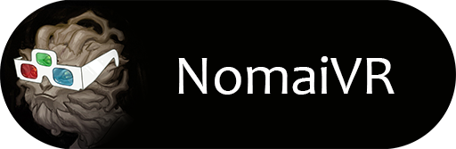

# NomaiVR - Outer Wilds VR Mod

<!-- TOC -->

- [YOU WILL HAVE A BAD TIME](#you-will-have-a-bad-time)
- [Requirements](#requirements)
- [VR Controller Inputs](#vr-controller-inputs)
- [Installation](#installation)
  - [Easy installation (recommended)](#easy-installation-recommended)
  - [Manual installation](#manual-installation)
  - [If you have Oculus](#if-you-have-oculus)
- [Performance](#performance)
  - [Framerate](#framerate)
- [Compatibility with other mods](#compatibility-with-other-mods)
- [Contributing](#contributing)
- [Development Setup](#development-setup)
- [Help / Discuss development / Tell me about your day](#help--discuss-development--tell-me-about-your-day)

<!-- /TOC -->

## YOU WILL HAVE A BAD TIME

The game should be playable from start to finish in VR, but it's not gonna be super comfortable:

- A good portion of the game is spent spinning around in zero-g, which can be very disorienting;
- It's not uncommon to get motion sickness playing this game in pancake mode, let alone in VR;
- No comfort features like teleport and snap turning were implemented;
- The game was not optimized for VR so you might notice some stuttering;
- It's all dirty hacks on top of even dirtier hacks.

Expect nausea, low performance, flashing images, crashes, blue screens, house fires, etc. Have a look at the [currently open issues](https://github.com/Raicuparta/NomaiVR/issues) to have an idea of some of the stuff that needs fixing.

## Requirements

- A VR Headset;
- VR controllers (not playable with a regular game controller);
- A VR-Ready PC;
- Steam and SteamVR installed and running prior to opening the game;
- Strong VR legs (both due to the nature of the game, and due to the glitchiness of this VR implementation).

## VR Controller Inputs

There are some extra in-game tutorials for teaching you VR inputs, but some stuff doesn't have any tutorials yet.

- You can't change the control bindings in-game (they will always reset);
- Your headset might not have any default bindings, in which case you'll have to make your own through SteamVR;
- You can interact with most stuff by aiming with the right-hand laser and pressing the interact button;
- Right hand grip can be used to grab tools from the tool belt;
- Change tool modes by holding a tool on your right hand and touching it with your left hand;
- While piloting the ship, you can aim at and interact with stuff inside the ship (interact with the screens to equip that tool);
- Turn on the flashlight by touching the side of your head with your right hand;
- Experiment with the controls. When in doubt, aim laser and press interact.

## Installation

### Easy installation (recommended)

- [Install the Outer Wilds Mod Manager](https://github.com/Raicuparta/ow-mod-manager#how-do-i-use-this);
- Install NomaiVR from the mod list displayed in the application;
- If you can't get the mod manager to work, follow the instructions for manual installation.

### Manual installation

- [Install OWML](https://github.com/amazingalek/owml#installation);
- [Download the latest NomaiVR release](https://github.com/Raicuparta/NomaiVR/releases/latest);
- Extract the `NomaiVR` directory to the `OWML/Mods` directory;
- Run `OWML.Launcher.exe` to start the game.

### If you have Oculus

- Find OWML's directory (either inside the mod manager's directory, or wherever extracted OWML to);
- Create a shortcut to `OWML.Launcher.exe` and add the params `-vrmode openvr` ([like in this image](https://i.imgur.com/5uv88Nk.png))
- Use the shortcut you just created to launch the game;

## Performance

This game was not developed with VR in mind. It was also never a super lightweight game, and shoving VR down its throat isn't helping. You'll probably need to lower your quality settings to get acceptable performance. Shadows and ambient occlusion usually have a big impact.

### Framerate

Outer Wilds was originally locked to 60 FPS. To work around this, NomaiVR forces the game's physics refresh rate to match your VR headset's refresh rate. This can have a high impact in performance. Try lowering your refresh rate through SteamVR's settings (if your headset supports this) to get a more stable framerate.

If your headset doesn't support this, you can override the refresh rate the NomaiVR's settings file (`OWML/Mods/NomaiVR/config.json`). Change `overrideRefreshRate` to whatever framerate you desire. Setting it to zero makes it follow your VR headset's refresh rate.

## Compatibility with other mods

NomaiVR affects code in pretty much the whole game, and drastically changes things in ways that are sure to break other mods. If you are having issues, make sure you disable any other mods you might have installed.

## Contributing

Look at through [currently open issues](https://github.com/Raicuparta/NomaiVR/issues) and see if there's something you'd like to help with. There's a few ways you can help:

- Test the game, find bugs, report them as a new issue;
- Open issue with feature requests;
- Contribute to the code base (fork the repo and open a PR).

## Development Setup

- [Download the Outer Wilds Mod Manager](https://github.com/Raicuparta/ow-mod-manager) and install it anywhere you like;
- Install OWML using the Mod Manager;
- Clone NomaiVR's source;
- Open the file `NomaiVR/NomaiVR.csproj.user` in your favorite text editor;
- Edit the entry `<GameDir>` to point to the directory where Outer Wilds is installed;
- Edit the entry `<OwmlDir>` to point to your OWML directory (it is installed inside the Mod Manager directory);
- Repeat this process for the file `SteamVR/SteamVR.csproj.user`;
- Open the project solution file `NomaiVR.sln` in Visual Studio;
- If needed, right click `References` in the Solution Explorer > Manage NuGet Packages > Update OWML to fix missing references;

After doing this, the project references should be working. When you build the solution, the dll and json files will be copied to `[Mod Manager directory]/OWML/NomaiVR`. If this process is successful, you should see the mod show up in the Mod Manager.

If for some reason none of this is working, you might have to set everything manually:

- To fix the references, right-click "References" in the Solution Explorer > "Add Reference", and add all the missing DLLs (references with yellow warning icon). You can find these DLLs in the game's directory (`OuterWilds\OuterWilds_Data\Managed`);
- If Visual Studio isn't able to automatically copy the files, you'll have to copy the built dlls manually to OWML.

## Help / Discuss development / Tell me about your day

[Join the Outer Wilds Discord](https://discord.gg/Sftcc9Z), we have a nice `#modding` channel where you can discuss all types of things.
