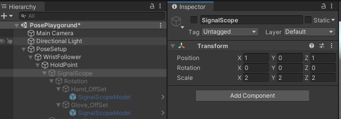
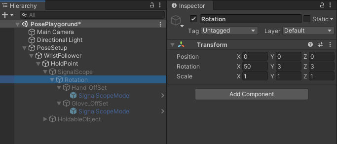
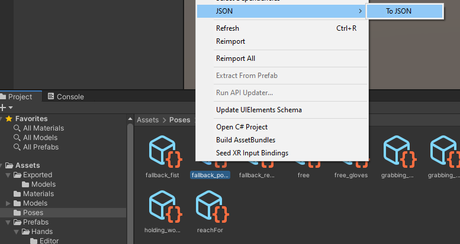

# Bad tutorial on how to make poses
## General Guideline
A few rules to start:

- It should be clear that uploading game assets extracted from the game as-is without remaking them or havily modfying is not allowed and should be avoided, assets exported from the game to create new poses for should be placed under the *Assets/Exported/* directory
- Never override the PosesPlayground scene with changes that aren't necessary
- Due to the nature of asset bundles, poses can't be directly imported so the last few steps of the guide will explain how to export them
- Be sure to set Unity's rotation and coordinates handling to **Pivot** and **Global/Local**

## Process Steps

The generic steps to make a pose are
- Identify prefab used in the game for the item/tool we wan to make a pose for
- Extract the prefab
- Import the prefab in the playground
- Make the poses
- Save and Export the poses

## Tool/Item extraction

You can extract prefabs from the game with commonly used extraction tools from the game. In order to have an easier time, be sure that the prefab you extract has the same hierarchy which it will have when parented to the hand in the mod.

Generally, though, models for items are expected to be centered with their origin in the origin of the prefab and no additional rotations, since most of the movements will be done in the playground hierarchy (documented later).

Tools/Items should be saved under *Assets/Exported/* which is ignored and **never** pushed to the repo.

## Playground Setup and Importing

The playground scene (*Assets/Scenes/PosePlayground.scene*) has a structure like this


### PoseSetup

This is the object where the SteamVR_Skeleton_Poser is placed, this will be used to preview, edit and save poses. How to use it will not be documented here, just go ahead and look at [Zulubo's Tutorial](https://www.youtube.com/watch?v=a9EBILq2ep8) on how to use it.

The features that we'll use are the right hand preview (left hand preview hasn't been setup in the project) and the basic functionalities of the pose editor, everything else (Fallbacks, Blenders, etc.) will be ignored.

Only bone rotations for the Thumb, Index and Ring fingers are stored and used in the mod. Save all the poses to *Assets/Poses/* and remember to copy the right pose to the left one before saving. The naming scheme for the poses is *{posename_glove/hand}*, if a pose is good for both gloves and hands omit the last part. Poses are assigned to objects in their respective NomaiVR/Tools/{HoldItem/HoldSignalscope/...} classes.

### WristFollower/HoldPoint

This is the part of the scene where we'll put our imported model, sockets for each element should already be present.

In general each item/tool will have a hierarchy like this:
- *WristFollower/HoldPoint/{Name}/Rotation/{Hand/Glove}_Offset*

So to preview one item you'll need to enable the Hand or Glove offset and move the extracted model under that.

If an item is not yet available you need to create these objects following these rules.

#### *{Name}*
This is an empty object that should have a Position and Scale equal to the ones given to the corresponding coded Holdable in the mod. (*ex. Signalscope*)

```csharp
var holdSignalscope = _signalscope.gameObject.AddComponent<Holdable>();

holdSignalscope.transform.localPosition = new Vector3(1,0,1);
holdSignalscope.transform.localScale = Vector3.one*2;
holdSignalscope.SetRotationOffset(Quaternion.Euler(50, 3, 3));
holdSignalscope.SetPositionOffset(new Vector3(1,2,1), new Vector3(0,0,1));
```

Will have a *{Name}* node like this:



Items will have a name ending with *Socket* and they mostly have the same Scale and Position (just copy it from the other already available). Some items require to look at their scale in the game though (like the VesselSocket) to do this UnityExplorer is needed.

#### Rotation
This is an empty object that should have the Rotation assigned to the holdable object by the mod, so from the previous example:

```csharp
var holdSignalscope = _signalscope.gameObject.AddComponent<Holdable>();

holdSignalscope.transform.localPosition = new Vector3(1,0,1);
holdSignalscope.transform.localScale = Vector3.one*2;
holdSignalscope.SetRotationOffset(Quaternion.Euler(50, 3, 3));
holdSignalscope.SetPositionOffset(new Vector3(1,2,1), new Vector3(0,0,1));
```



#### Offsets

The last element consist in offsets assigned to the holdable that are different between hands and gloves, these are also set with calls to SetPositionOffset.

```csharp
holdSignalscope.SetPositionOffset(new Vector3(1,2,1), new Vector3(0,0,1));
//                               ^hand_offset         ^glove_offset
```

## Make Pose


To make a pose just select the *PoseSetup* object in the scene and in the inspector in the SteamVR_Pose_Editor create a new pose.

Show the right hand preview will add an object to the scene *hand_pose_setup(Clone)* where you can enable or disable its childs to view the glove and hand previews.

The Root skeleton you need to rotate is under *hand_pose_setup(Clone)/Root/wrist_r* and the bones that affect the hand are the ones for the Thumb, Index and Ring finger.

Moving the wrist/root isn't supported.

When done save the pose as mentioned in the **PoseSetup** section.

## Export the pose

When a pose is saved as an asset, to export it to the mod's folder. Right click on the generated asset, then "*JSON->To JSON*".



Save the file to */NomaiVR/Hands/Poses* and you should be able to use the pose in the mod.
